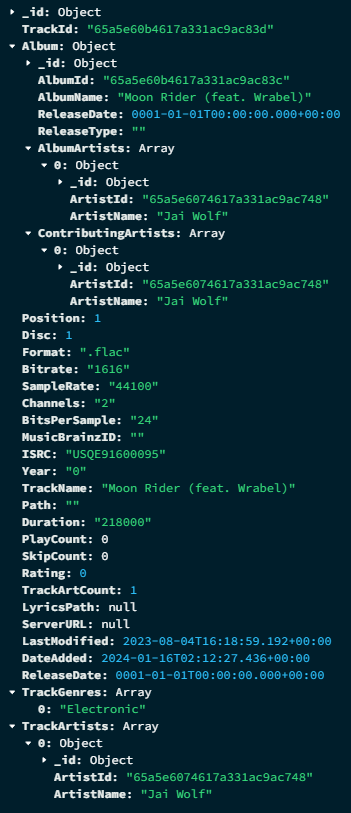
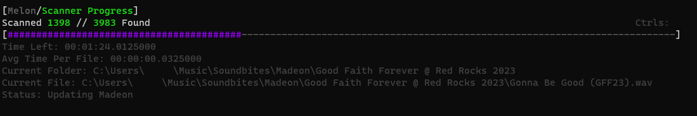

For the last 2 years I've been acquiring songs I like in as high quality as I can find and saving them locally. This started when spotify started removing music I liked such as Exile Vilify. I wanted to have my own stash of music so I wouldn't loose access to the songs that mean the most to me. I've been using Plex to listen to my local library ever since, but Plex has so many issues that bother me. I've looked into other options like Jellyfin, but all the big media servers seem to have tacked on music as an after thought. I want it to be better and I want more control. So now I'm making Melon, the music focused media player.

This project started in May of 2023, with an experimental scanner. I toyed with lots of options for databases, along with what to store and how. I ended up with MongoDB, as it's json-like document system is super powerful for this use case. The Melon Scanner combs recursively through the folders you specify logging every music file and .lrc file. It gets the track information from the music file metadata, so you'll want to use a tool like [MusicBrainz Picard](https://picard.musicbrainz.org/). MusicBrainz's data is what I'm modeling off of, so support for it's metadata tags will be in Melon. Below is an example of a Track in the db.

After getting it mostly working (it didn't actually, I've had to fix that scanner code a million times later) I created a nice UI to allow for initial setup and control of the database. This UI has gone through many stages but I'm really happy with the current result. A headless mode also exists now if you don't want to run with the UI.

I've since started learning ASP.NET and creating a web API for clients to interact with. I've got lots of work done, and most of the main endpoints such as search, playlists, and play statistics are all pretty much done. But i've got quite a few more things to finish. Currently I'm working on endpoints to allow updating track/album/artist info, but I've also got endpoints like recommendations, ratings, and user friending to get done. The project is awhile off, probably a few more months to finish the server.

I plan on creating a Windows and iOS application for v1 release. I'd also like other Apple device apps like MacOS and tvOS. I don't own an android phone, so I'm not creating an app for it myself. A friend of mine has been working on one at the same time as I'm creating the server, which has been a huge help in testing and modeling how things will work. In the end, I want it to be accessible for any developer to make apps for melon if they'd like.

All my previous projects have been open source and free, however I'm trying to think of a good way to make some money from this project. It's taken so much effort and I'm really proud of it, and I think it'll be worth the price. So the plan right now is the Melon server code will be open and anyone can grab a build of the server to spin up themselves, but the apps will either be paid, have a free trial, or have some features locked behind a pro version. I've thought about making the code for the apps open too, so if you don't want to pay or just want to try it out first, you can build it yourself. I'm not set on any of these ideas, nor the price. I do know that it will NOT be a subscription, just a one time payment.

I'll talk more about features and pricing when the time comes. I mostly wanted to make this blog post to show I'm alive and working on something big. I'll likely post more devlogs here and there, and I'll announce on my socials when it's time for release!
