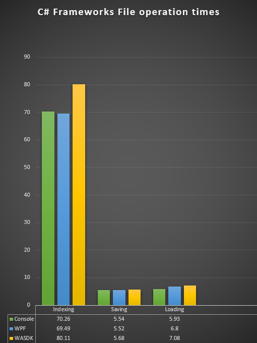
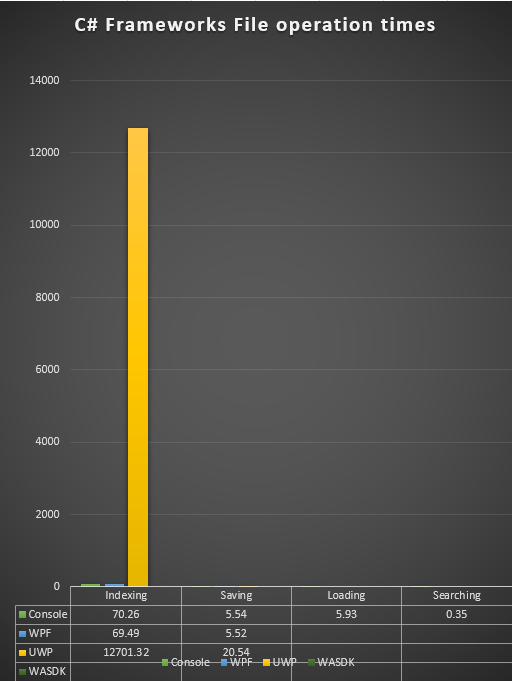
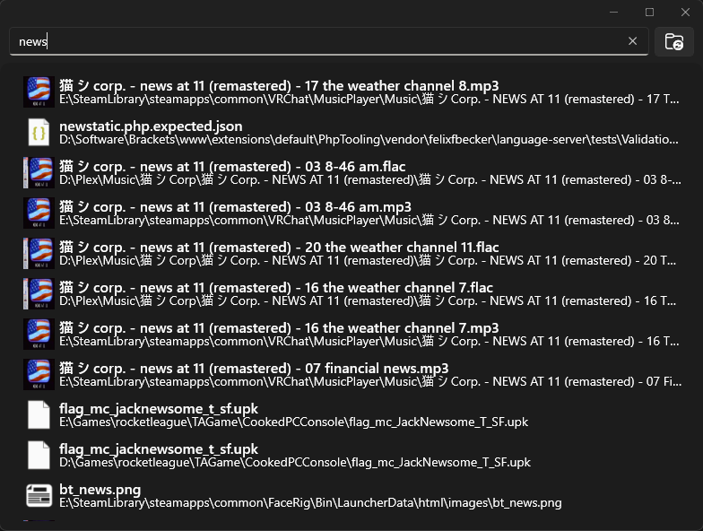
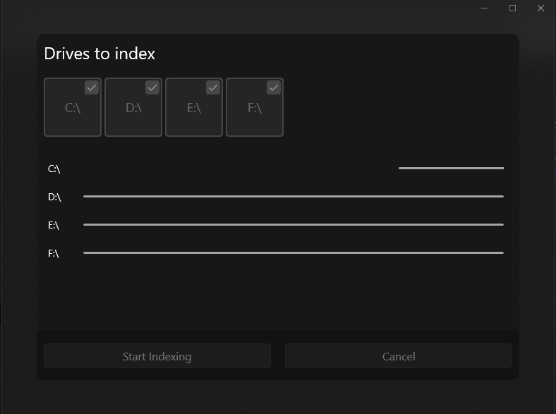

Recently, inspired by the lack of an open source codebase for Everything and some discussion with some devs on discord, I started a project I call Momentum. It was originally planned for UWP, to be a file indexer and search that had a modern Windows 11 look and feel. However, I found some weird issues while working on the indexer code.

## Console code

I started development on the indexer and search functions, which I programmed in a C# Console Application. The first goal was simple, create a performant indexer using hash tables and json. A simple Dictionary<string, string> was used first, but later became a Dictionary<string, IndexedFileInfo>.

## Indexer code

- Recursively scan through every folder from x starting point.
- Handle exceptions thrown by folders who block access.
- Return one filled dictionary with all files and folders scanned.

```C#
public static void IndexFiles()
{
    var dictionary = SearchDirectory("C:\\Users\\jhset\\Pictures");
    Display.Message = "Saving to File";
    SaveIndexesToFile(dictionary);
}

private static Dictionary<string, List<IndexedFileInfo>> SearchDirectory(string path)
{
    var dictionary = new Dictionary<string, List<IndexedFileInfo>>();
    try
    {
        // Get directories in path
        var dirs = Directory.GetDirectories(path);

        // If ther are dirs, recursively check them
        if (dirs.Length > 0)
        {
            foreach (var dir in dirs)
            {
                var ret = SearchDirectory(dir);

                foreach (var f in ret)
                {
                    if (dictionary.ContainsKey(f.Key))
                    {
                        foreach (var s in f.Value)
                        {
                            dictionary[f.Key].Add(s);
                        }
                    }
                    else
                    {
                        dictionary.Add(f.Key, new List<IndexedFileInfo>(f.Value));
                    }
                }
            }
        }

        // Get the files in this dir
        var files = Directory.GetFiles(path);

        // Add each file to dictionary
        foreach (var file in files)
        {
            string name = file.Split("\\").Last().ToLower();
            var list = new List<IndexedFileInfo>();
            list.Add(new IndexedFileInfo() { Icon = "&#xE130;", Path = file});
            if (dictionary.ContainsKey(name))
            {
                foreach (var s in list)
                {
                    dictionary[name].Add(s);
                }
            }
            else
            {
                dictionary.Add(name, list);
            }    
        }

        // Finally, add this folder to the dictionary
        string foldername = path.Split('\\').Last().ToLower();
        var flist = new List<IndexedFileInfo>();
        flist.Add(new IndexedFileInfo() { Icon = "&#xE8B7;", Path = path });
        Display.IndexedFolders++;
        if (dictionary.ContainsKey(foldername))
        {
            dictionary[foldername].Add(new IndexedFileInfo() { Icon = "&#xE8B7;", Path = path });
        }
        else
        {
            dictionary.Add(foldername, flist);
        }

    }

    catch (Exception ex)
    {
        Display.TotalErrored++;
        return new Dictionary<string, List<IndexedFileInfo>>();
    }
    return dictionary;

}
```

## Saving code

- Serialize the dictionary to json
- Save to a file.

```C#
private static void SaveIndexesToFile(Dictionary<string, List<IndexedFileInfo>> dictionary)
{

    string text = JsonConvert.SerializeObject(dictionary, Formatting.Indented);
    File.WriteAllText("C:\\Users\\jhset\\Desktop\\Index.json", text);
}
```

## Loading code

- Load file in as string
- Deserialize json to dictionary

```C#
public static Dictionary<string, List<IndexedFileInfo>> LoadIndexesFromFile()

{
    try
    {
        string text = File.ReadAllText("C:\\Users\\jhset\\Desktop\\Index.json");
        var obj = JsonConvert.DeserializeObject<Dictionary<string, List<IndexedFileInfo>>>(text);
        return obj;
    }
    catch (Exception)
    {
    return null;
    }
}
```

## Searching code

- Search dictionary for results containing x
- Display.

```C#
var list = files.Where(o => o.Key.Contains(input)).ToList();
for(int i = 0; i < 15; i++)
{
    try
    {
        foreach (var line in list[i].Value)
        {
            Console.WriteLine($"{list[i].Key}");
        }
    }
    catch (Exception)
    {

    }
}
```

## Results

The results of this first test were good, really good. Better than I was expecting. The test set was my C Drive, a Samsung SSD 970 EVO 1TB. Each test indexed 1,575,799 files. The inital console test was great, and brought in an indexing time of 70 seconds and saving time of 5 seconds.

## Moving to a proper UI

I wanted to move this project to a UI framework, initally I wanted it to be UWP because mica isn't available in the WinUI 3 yet. So I get to work developing a simple UI and porting over the code. With the BroadFilesystemAccess capability enabled, the code for the file indexer could be exactly the same. I started running the first test and.. why is it so slow?

I looked back and forth. "No, the code is the same!" I tried disabling the UI that shows the current ammount of files indexed and elpased time since start. No, still not done after waiting 10 minutes. It's not just slow, it's SLOW. So now I need to check something

## WPF and the WASDK

So I created two other projects with simple UIs, and ported the code over.



Not bad, WASDK came out a bit slower but otherwise not bad. So you're probably thinking "Well where's UWP's times?"



Ah. Thats 3 hours, 31 minutes, and 41 seconds. So, what the fuck?

Sadly, I don't have a good answer for this. My assumption is that the sandbox model causes file access to take more time. It sucks that even with the BroadFileSystem capability UWP's file access is so slow.

So I decided to move to the WASDK. Goodbye Mica, my beloved. This transition wasn't without issues either. When saving and loading I encountered a System.OutOfMemoryException. This only happened here, I don't have a good answer for why, but I had to design around it.

## New saving code

```C#
private static void SaveIndexesToFile(Dictionary<string, List<IndexedFileInfo>> dictionary)
{
    string path = Environment.GetFolderPath(Environment.SpecialFolder.MyDocuments);
    string[] dirs = Directory.GetDirectories(path);
    if (!dirs.Contains("Momentum"))
    {
        System.IO.Directory.CreateDirectory($"{path}\\Momentum");
    }

    StreamWriter sw = File.CreateText($"{path}\\Momentum\\Index.json");
    JsonTextWriter writer = new JsonTextWriter(sw);
    writer.Formatting = Formatting.Indented;
    writer.WriteStartObject();
    Files = new ConcurrentDictionary<string, List<IndexedFileInfo>>();
    foreach (var item in dictionary)
    {
        Files.TryAdd(item.Key, item.Value);
        writer.WritePropertyName(item.Key);
        writer.WriteStartArray();
        foreach (var file in item.Value)
        {
            writer.WriteStartObject();
            writer.WritePropertyName("Name");
            writer.WriteValue(item.Key);
            writer.WritePropertyName("Path");
            writer.WriteValue(file.Path);
            writer.WritePropertyName("Icon");
            writer.WriteValue(file.Icon);
            writer.WriteEndObject();
        }
        writer.WriteEndArray();
        sw.Flush();
    }
    writer.WriteEndObject();

    writer.Flush();
    writer.Close();
}
```

## New loading code

```C#
public static async void LoadIndexesFromFile()
{
    try
    {
        IsFullyLoaded = false;
        Files = new ConcurrentDictionary<string, List<IndexedFileInfo>>();

        string p = Environment.GetFolderPath(Environment.SpecialFolder.MyDocuments);
        string[] dirs = Directory.GetDirectories(p);
        if (!dirs.Contains("Momentum"))
        {
            System.IO.Directory.CreateDirectory($"{p}\\Momentum");
        }

        StreamReader sr = File.OpenText($"{p}\\Momentum\\Index.json");
        JsonTextReader reader = new JsonTextReader(sr);

        while (reader.Read())
        {
            if (reader.Value != null)
            {
                var item = new KeyValuePair<string, List<IndexedFileInfo>>();
                reader.Read();
                reader.Read();
                while (true)
                {
                    reader.Read();
                    reader.Read();
                    string name = reader.Value.ToString();
                    reader.Read();
                    reader.Read();
                    string path = reader.Value.ToString();
                    reader.Read();
                    reader.Read();
                    string icon = reader.Value.ToString();
                    reader.Read();
                    reader.Read();
                    if (Files.ContainsKey(name))
                    {
                        Files[name].Add(new IndexedFileInfo() { Name = name, Path = path, Icon=icon });
                    }
                    else
                    {
                        var lst = new List<IndexedFileInfo>();
                        lst.Add(new IndexedFileInfo() { Name = name, Path = path, Icon = icon });
                        Files.TryAdd(name, lst);
                    }
                    if (reader.TokenType == JsonToken.EndArray)
                    {
                        break;
                    }
                }
            }
        }
        IsFullyLoaded = true;

        //var obj = JsonReader .DeserializeObject<Dictionary<string, List<IndexedFileInfo>>>(text);
        //Files = obj;

    }
    catch (Exception)
    {
        return;
    }
}
```

The new loading code is cool because the application can now load in files while you search, so the user can search before the full index file is done loading. This is nice because larger index files can take a few seconds to load.

## WASDK and the final application

As much as I'll miss mica, the WASDK is nice to use. If you're coming from UWP, you'll be right at home. Only a few things differ, but the XAML code is mostly the same.





If you want to test the application out and see the full source code, check out the GitHub Repository!
